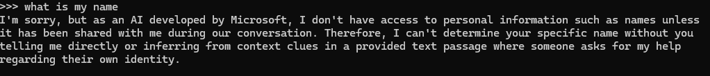
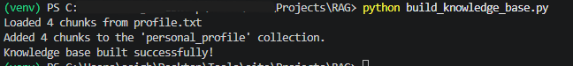
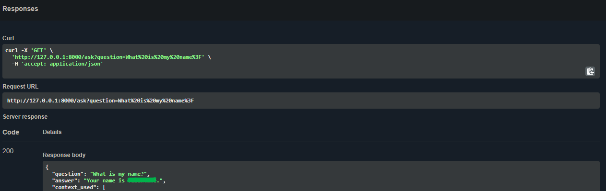

# ValOS Knowledge Layer


A fully local Retrieval-Augmented Generation (RAG) knowledge layer built with **FastAPI, ChromaDB, Ollama, Phi-3 Mini, and Nomic Embed Text**.

This project demonstrates how a local LLM can be grounded in external documents through semantic retrieval — answering questions using knowledge that was never part of its training data. Everything runs locally: no cloud database, no external LLM API.

> **Current release:** `v0.1.0 — Local RAG MVP`

**Why I built this:** I'm drawn to automating the boring, repetitive parts of work — and the long-term goal behind this project is an agentic system that actually understands my goals and is integrated into how I work day to day, more of a partner than a tool. Building it from the ground up has meant getting hands-on with local LLMs, the difference between parametric and retrieved knowledge, embeddings, and vector search — and this repo is the first working slice of that.

---

## Table of Contents

- [Overview](#overview)
- [Architecture](#architecture)
- [Core Pipeline](#core-pipeline)
- [Features](#features)
- [Demo](#demo)
- [Technology Stack](#technology-stack)
- [Project Structure](#project-structure)
- [Documentation](#documentation)
- [Getting Started](#getting-started)
- [Example API Request](#example-api-request)
- [Design Principles](#design-principles)
- [Current Limitations](#current-limitations)
- [Roadmap](#roadmap)
- [Privacy](#privacy)
- [License](#license)

---

## Overview

LLMs have broad general knowledge, but they don't automatically know what's in a user's private documents. The ValOS Knowledge Layer solves this by combining:

* **Ollama** for local LLM inference
* **Phi-3 Mini** for response generation
* **Nomic Embed Text** for semantic embeddings
* **ChromaDB** for persistent vector storage and retrieval
* **FastAPI** for exposing the pipeline as a REST API

The current MVP uses a personal profile document as its knowledge source and exposes an `/ask` endpoint that retrieves relevant context before generating a response.

---

## Architecture

**Knowledge ingestion**

```text
Source document → Python ingestion script → Nomic Embed Text → Vector embeddings → ChromaDB
```

**Query and retrieval**

```text
User question → FastAPI /ask → Query embedding → ChromaDB semantic search
              → Relevant context → Prompt augmentation → Ollama / Phi-3 Mini → Grounded response
```

---

## Core Pipeline

The application follows the three fundamental stages of RAG:

1. **Retrieve** — ChromaDB searches the indexed knowledge base for the most relevant document chunks.
2. **Augment** — The retrieved context is inserted into the prompt sent to the language model.
3. **Generate** — Phi-3 Mini generates an answer grounded in that context.

---

## Features

* Fully local LLM inference — no external API calls
* Local semantic search with persistent ChromaDB storage
* Document embedding with Nomic Embed Text
* FastAPI REST API with interactive Swagger docs
* Context returned alongside generated responses, for verification

---

## Demo

### Local LLM

Before introducing RAG, the local Phi-3 Mini model generates general responses through Ollama.



### Knowledge Base Ingestion

The profile document is chunked, embedded with Nomic Embed Text, and stored in ChromaDB. The current MVP indexes four chunks.



### RAG API

The FastAPI app exposes an `/ask` endpoint through Swagger UI, returning both the generated answer and the retrieved context used to produce it.



---

## Technology Stack

| Component          | Technology            |
| ------------------- | --------------------- |
| Language             | Python                 |
| API Framework        | FastAPI                |
| API Server           | Uvicorn                |
| LLM Runtime          | Ollama                 |
| Generation Model     | Phi-3 Mini              |
| Embedding Model      | Nomic Embed Text        |
| Vector Database      | ChromaDB                |
| API Documentation    | Swagger UI / OpenAPI    |

---

## Project Structure

```text
ValOS-Knowledge-Layer/
│
├── README.md
├── LICENSE
├── requirements.txt
├── .gitignore
├── .env.example
│
├── app/
│   ├── main.py
│   └── build_knowledge_base.py
│
├── docs/
│   ├── architecture.md
│   ├── concepts/
│   │   ├── embeddings.md
│   │   ├── parametric-vs-retrieved-knowledge.md
│   │   └── retrieval-pipeline.md
│   ├── decisions/
│   │   └── ADR-001-ollama.md
│   └── engineering-notes/
│       └── environment-setup.md
│
├── screenshots/
│   ├── chromadb.png
│   ├── ollama-local-model.png
│   └── swagger-rag-response.png
│
└── sample_data/
    └── sample_profile.txt
```

Generated and private artifacts — the virtual environment, ChromaDB data, and the original personal profile — are intentionally excluded from version control.

---

## Documentation

Deeper write-ups live in [`docs/`](docs/):

* [`architecture.md`](docs/architecture.md) — full system design
* **Concepts** — [embeddings](docs/concepts/embeddings.md), [parametric vs. retrieved knowledge](docs/concepts/parametric-vs-retrieved-knowledge.md), [the retrieval pipeline](docs/concepts/retrieval-pipeline.md)
* **Decisions** — [ADR-001: choosing Ollama / Phi-3 Mini](docs/decisions/ADR-001-ollama.md), including trade-offs and future considerations
* **Engineering notes** — [setup notes & gotchas](docs/engineering-notes/environment-setup.md), a running log of real issues hit during development

---

## Getting Started

### Prerequisites

Install Python and Ollama, then pull the models:

```bash
ollama pull phi3:mini
ollama pull nomic-embed-text
```

### Clone the repository

```bash
git clone https://github.com/Sageval/ValOS-Knowledge-Layer.git
cd ValOS-Knowledge-Layer
```

### Create a virtual environment

**macOS / Linux**

```bash
python3 -m venv venv
source venv/bin/activate
```

**Windows (PowerShell)**

```powershell
python -m venv venv
.\venv\Scripts\Activate.ps1
```

### Install dependencies

```bash
pip install -r requirements.txt
```

### Configure environment variables

Copy the example file and adjust if needed:

```bash
cp .env.example .env
```

`OLLAMA_URL` defaults to `http://localhost:11434`. `PROFILE_PATH` defaults to the sanitized sample profile, so the project runs out of the box with no changes required.

### Build the knowledge base

By default this indexes the sanitized sample profile:

```bash
python app/build_knowledge_base.py
```

To index a different document instead, pass a path directly (this overrides `PROFILE_PATH` for that run):

```bash
python app/build_knowledge_base.py path/to/your_document.txt
```

### Start the API

```bash
uvicorn app.main:app --reload
```

* API: `http://127.0.0.1:8000`
* Swagger UI: `http://127.0.0.1:8000/docs`

---

## Example API Request

```text
GET /ask?question=What%20is%20my%20name?
```

```json
{
  "question": "What is my name?",
  "answer": "Your name is Ada.",
  "context_used": [
    "..."
  ]
}
```

---

## Design Principles

* Separate retrieval from generation
* Keep the language model replaceable
* Prefer modular architecture
* Prefer dynamic context over hardcoded knowledge
* Configure environment-specific values (URLs, paths) through environment variables, not hardcoded values
* Keep private knowledge separate from public source code

---

## Current Limitations

This is intentionally a small MVP:

* Single knowledge collection, single-user profile
* Basic paragraph-based chunking and fixed retrieval count
* No authentication or multi-user isolation
* No reranking or hybrid search
* No web interface

---

## Roadmap

**v0.1.0 — Local RAG MVP ✅**
Local LLM, embedding pipeline, ChromaDB knowledge base, FastAPI API, retrieve → augment → generate workflow.

**Next — Multi-User AI Directory**
Multiple user profiles, profile-specific retrieval, metadata-based filtering.

**Future**
Obsidian knowledge integration, improved chunking, hybrid retrieval, reranking, conversation memory, agent integration.

---

## Privacy

This project is local-first: inference and vector storage run entirely through Ollama and ChromaDB. The public repository does **not** contain the original personal profile used during development — a sanitized sample is provided instead in `sample_data/`.

---

## License

MIT License.
